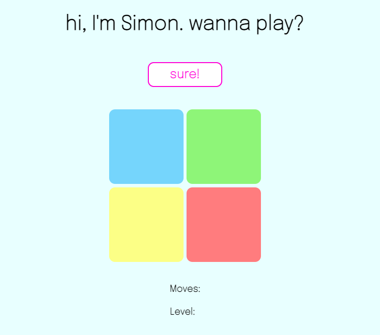
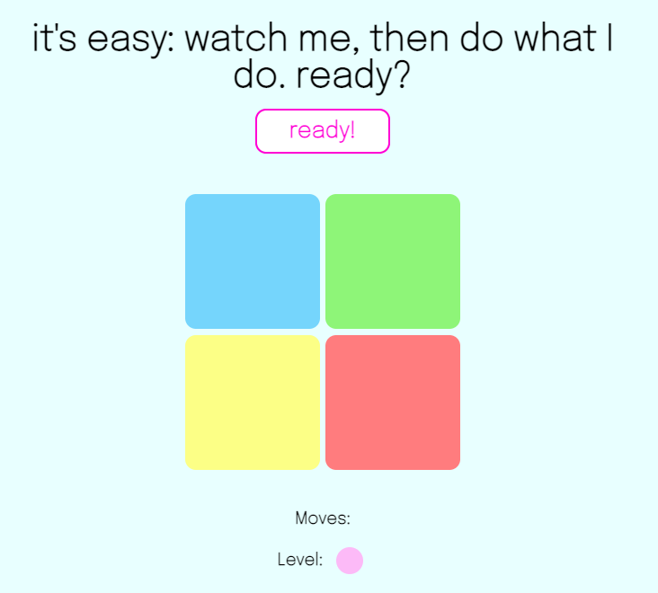

# Simon
**Meet Simon, a friendly, colorful computer who just wants you to copy what he does.**

### Introduction
This game is based on Simon, an electronic game invented in 1978 and manufactured by Milton Bradley (and later Hasbro). 

### Screenshots

### Technologies Used:
*HTML  
*CSS  
*JavaScript  

### Getting Started:

Play the game here: [Simon]()

### Game Play
It's easy - all you have to do is repeat what Simon says. There are four colors: blue, green, red, and yellow. Simon will choose a random color, "light up" that button, then give you a chance to copy what he did. Once you do, Simon will repeat his sequence and add a random move. If you successfully copy what he did, he'll add another, and another, and another. The game ends when you make a move that wasn't in Simon's sequence, but he'll ask if you want to play again.

### Next Steps:
- Add this game to Simon's Ocean
- Improve CSS for smaller screen sizes
- Sounds
